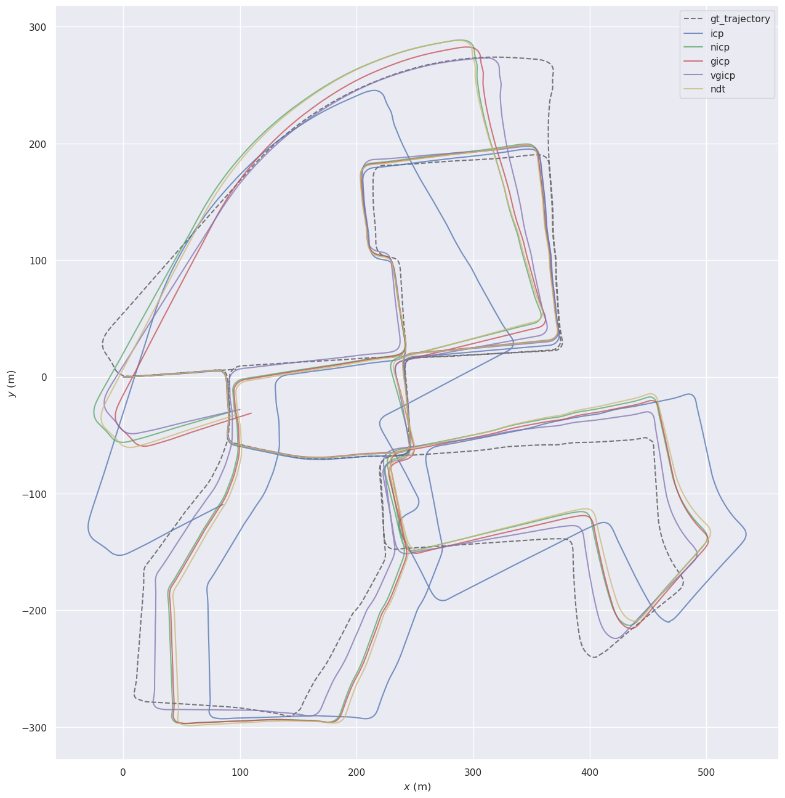

# optimization_learning

## Dependencies
- ROS2 jazzy
- Eigen 3.4.0
- PCL 1.14.0
- Ceres 2.2.0
- GTSAM 4.2.0
- OpenCV 4.6.0
- evo
  ```bash
  pip install evo --break-system-packages
  ```

## Comparison
### kitti_2011_10_03_0027
#### 1. downsample_timing_comparison

#### 2. gicp_traj_comparison

#### 3. gicp_timing_comparison


#### 4. reg_traj_comparison

#### 5. reg_timing_comparison


gicp_Ceres failed


## Todo list
- [x]  create dev container
- [x]  Migrate to ROS2 jazzy
- [x]  Add point-to-plane ICP
- [x]  Add NDT 
- [x]  Add GICP
- [ ]  Add ESKF
- [ ]  Add IMU-preintegration
## Question
1. issue #1
2. NICP Epsilon


## References
- [slam_in_autonomous_driving](https://github.com/gaoxiang12/slam_in_autonomous_driving)
- [optimized_ICP](https://github.com/zm0612/optimized_ICP)
- [small_gicp](https://github.com/koide3/small_gicp)
- [ndt_omp](https://github.com/koide3/ndt_omp)